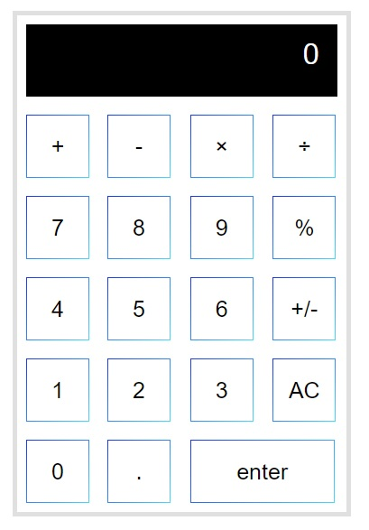

# Calculator
- 電卓アプリ  

## アプリケーションURL
https://github.com/akikom220711/230228calculator.git  

## 使用技術（実行環境）
- Windows 11
- PHP 8.1.6
- XAMPP 8.1.10
- Apache 2.4.53
  

## 環境構築
1. `git clone` でリポジトリをダウンロードする。

2. ダウンロードしたディレクトリを `C:\xampp\htdocs` に移動する。

3. XAMPP の Apache を起動する。

4. [http://localhost/calculator/index.php](http://localhost/calculator/index.php) にアクセスすることでアプリを実行することができる。
  

# 機能一覧
- 加算機能 
「＋」ボタンで行うことができる。  

- 減算機能 
「-」ボタンで行うことができる。  

- 乗算機能 
「×」ボタンで行うことができる。  

- 除算機能 
「÷」ボタンで行うことができる。  

- パーセント表示機能 
「％」ボタンで行うことができる。  

- 符号変換機能 
「+/-」ボタンで行うことができる。  

- クリア機能 
「AC」ボタンで行うことができる。  

